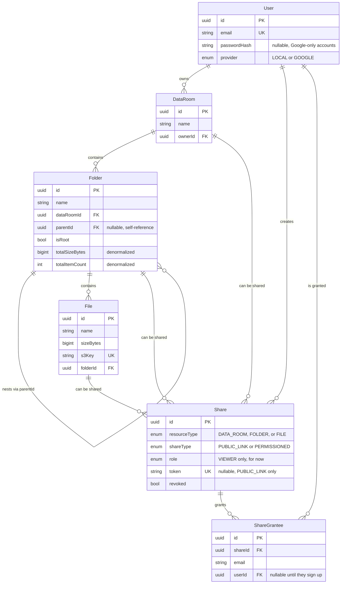

# Data Room

A document repository for due-diligence data rooms — folders, file uploads, and read-only sharing via public link or invited email. Built as a take-home assignment (Tailored Tech / Acme Corp brief).

Monorepo: `backend` (NestJS + Prisma + PostgreSQL) and `frontend` (React + Vite + TypeScript + Tailwind + shadcn/ui).

## Demo

- Frontend: https://test-tailored-tech.vercel.app
- Backend/API: https://test-tailored-tech.onrender.com

Backend is on Render's free tier, so the first request after idling can take ~30s to wake up.

## Tech Stack

- **Backend**: NestJS, Prisma, PostgreSQL, Passport (JWT + Google OAuth), AWS S3
- **Frontend**: React, Vite, TypeScript, Tailwind, shadcn/ui, React Router
- **Tooling**: ESLint (flat config, `simple-import-sort`), Prettier

## Features

- Email/password signup and login, plus Google OAuth
- Data rooms owned by a single user, invisible to everyone else by default
- Nested folders with breadcrumb navigation
- Multi-file upload with drag-and-drop and per-file progress
- File viewing via signed URL, rename, move, delete
- Folder rename, delete with a warning about what's inside
- Name-conflict handling on upload/rename (`report.pdf` → `report (1).pdf`)
- Sharing a data room, folder, or file as read-only, via public link or specific invited emails
- Revoking a share

## Architecture / Design Decisions

- **A `DataRoom` owns one root `Folder`.** Everything else nests under it via `parentId`. One code path handles breadcrumbs, subtree deletes, and counters regardless of depth.
- **Files always belong to a folder**, never to a room directly — one rule for "where can this go."
- **Sharing is a single `Share` model**, not three tables. It points at exactly one of `dataRoomId` / `folderId` / `fileId`, and is either `PUBLIC_LINK` (token-based) or `PERMISSIONED` (explicit `ShareGrantee` rows by email). Both are read-only today.
- **Authorization is centralized in [`AccessService`](backend/src/common/access.service.ts).** Every folder/file access check goes through it: owner, or a live permissioned share on the resource or an ancestor. Anything that fails returns `404`, not `403`, so shared content doesn't leak whether it exists.
- **Public links resolve anonymously by token**, walking the same ancestor chain so a link can't be used to browse outside what was actually shared.
- **Uploads go straight to S3.** The backend hands back a presigned PUT URL, the browser uploads directly and reports progress, then confirms with the backend to create the DB row. Downloads/viewing use a signed URL the same way.
- **Name conflicts are resolved by one shared utility** ([`name-conflict.util.ts`](backend/src/common/name-conflict.util.ts)), used for uploads, renames, and folder creation.
- **Folder size/item counts are denormalized**, not computed on read — see [Scaling](#scaling-considerations).

## Setup

Requires Node 20+, a PostgreSQL database, an S3 bucket with IAM credentials, and a Google OAuth client.

### Backend

```bash
cd backend
cp .env.example .env   # fill in DATABASE_URL, JWT secrets, AWS creds, Google OAuth creds
npm install
npx prisma migrate deploy
npm run start:dev      # http://localhost:4000
```

Use `npx prisma migrate dev` instead of `migrate deploy` if you're changing the schema locally.

### Frontend

```bash
cd frontend
cp .env.example .env   # VITE_API_URL, defaults to http://localhost:4000
npm install
npm run dev             # http://localhost:5173
```

### Environment Variables

**`backend/.env`**

| Variable                                                                    | Purpose                                                      |
| --------------------------------------------------------------------------- | ------------------------------------------------------------ |
| `DATABASE_URL`                                                              | Postgres connection string                                   |
| `DIRECT_URL`                                                                | Direct (non-pooled) Postgres connection, used for migrations |
| `PORT`                                                                      | API port, default `4000`                                     |
| `FRONTEND_URL`                                                              | Used for CORS, OAuth redirect, and share links               |
| `JWT_SECRET`, `JWT_EXPIRES_IN`                                              | Signs the auth JWT (httpOnly cookie)                         |
| `COOKIE_SECRET`                                                             | Cookie-parser signing secret                                 |
| `GOOGLE_CLIENT_ID`, `GOOGLE_CLIENT_SECRET`, `GOOGLE_CALLBACK_URL`           | Google OAuth credentials                                     |
| `AWS_REGION`, `AWS_ACCESS_KEY_ID`, `AWS_SECRET_ACCESS_KEY`, `AWS_S3_BUCKET` | S3 storage                                                   |

**`frontend/.env`**

| Variable       | Purpose                     |
| -------------- | --------------------------- |
| `VITE_API_URL` | Base URL of the backend API |

Don't put real values for any of these in this file — only `.env.example` is committed.

### Deployment

Backend runs on Render from [`backend/Dockerfile`](backend/Dockerfile) (builds the app, runs `prisma migrate deploy` on boot, then starts the server). Database is a hosted Postgres instance on Supabase. Frontend is on Vercel, built with [`frontend/vercel.json`](frontend/vercel.json) handling SPA rewrites for client-side routing. See [Demo](#demo) for live URLs.

## Data Model



Full schema: [`backend/prisma/schema.prisma`](backend/prisma/schema.prisma).

## Scaling Considerations

### Folder subtree size/count

Each `Folder` row stores `totalSizeBytes` and `totalItemCount` for its whole subtree, updated on every mutation (upload, delete, move, folder create/delete) rather than recomputed on read. A write walks from the changed folder up to the room root and increments/decrements each ancestor — see `adjustAncestorCounters` in [`folders.service.ts`](backend/src/folders/folders.service.ts).

Tradeoff: reads are a single row lookup regardless of subtree size, but every write costs one `UPDATE` per ancestor (proportional to tree depth). A recursive CTE would avoid that write cost but make every folder view scale with the size of the whole tree — the wrong axis to be slow on.

### 100,000 files

- `GET /folders/:id` currently returns all children in one response. That needs cursor-based pagination before it holds up at this scale — `OFFSET` pagination still scans and discards rows it skips.
- `File.folderId` and `Folder.parentId` are already indexed. Sorting/filtering large listings by name or date would want a composite index like `(folderId, updatedAt)`.
- No search exists yet. Postgres full-text search with a `GIN` index on `File.name` would work up to a point; an external index (OpenSearch, etc.) would be the next step past that.
- S3 itself doesn't get slower — keys are UUID-based and opaque. All the scaling pressure is on Postgres.

### Viewer/editor roles

`Share` already has a `role` column (`ShareRole` enum, currently only `VIEWER`). Adding `EDITOR` is additive:

1. Extend the enum — no data migration, existing rows stay `VIEWER`.
2. Let `CreateShareDto` accept a role instead of hardcoding `VIEWER`.
3. Have `AccessService` return the resolved role instead of a plain boolean, and have write endpoints (rename/delete/upload) check for `EDITOR` instead of requiring ownership.

Since grantees are already per-user/per-email and role lives on `Share` rather than being implied by `shareType`, granting different roles to different people on the same folder is just two `Share` rows — no schema rewrite. This isn't built, only the schema is ready for it.

## AI Usage

Claude Code was used throughout — schema design, backend modules, frontend, and this README were all drafted with it rather than written from scratch by hand. I reviewed the generated code, ran it, and fixed what didn't work (for example a `BigInt` JSON serialization crash caught by actually hitting the API, not by reading the code).

What still needs a closer look:

- The presigned S3 upload flow works against a real bucket (tested manually), but hasn't seen adversarial input — huge files, weird filenames, concurrent uploads to the same name.
- Authorization in `AccessService` is the highest-stakes code in this repo and got the most research, but it hasn't had a dedicated adversarial pass (can a revoked grantee still see cached data, can a public link escape its shared subtree).
- `MoveFileDialog`'s folder picker re-fetches on every navigation instead of caching (fine at demo scale, worth revisiting).

## Known Limitations

- No automated tests — verification so far is manual (running the app, hitting endpoints directly) plus TypeScript/build checks.
- No search or filtering across a data room.
- No file versioning — a name conflict gets a `(1)` suffix, not a version history.
- Sharing only supports read-only access; editor role is schema-ready but not implemented (see [Scaling](#scaling-considerations)).
